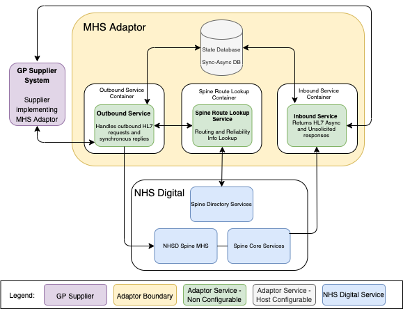

# National Integration Adaptors

The NHS are introducing a number of client-side adaptors to complement the existing API technologies on offer to accelerate integration with national NHS systems. These adaptors hide the complexity of integration with the interfaces provided by the current set of national systems by implementing a client side adaptor layer. The integrating supplier sees only a simplified and standardised set of interfaces presented by the adaptor layer. The adaptor layer is responsible for interacting with the legacy NHS Digital interface estate.

NHS Digital are providing adaptors shown as the "Adaptor Layer". This list of adaptors shown here is only an illustrative example. A full list and roadmap of adaptors and when they will be available will be published in due course.

Message Handling System (MHS) is an adaptor installed within your own environment that makes it easier to connect to the NHS Spine and perform business operations.

The MHS Adaptor implements a messaging standard called the External Interface Specification, which defines in some detail a number of patterns for transport layer communication with the NHS Spine. The intent of this MHS Adaptor is to hide this implementation detail from the supplier, and so make it easier to connect to Spine and perform business operations such as interacting with Spine services like PDS. This is done by providing a simple interface to allow HL7 messages to be sent to a remote Message Handler.

The following illustration shows the MHS adaptor in the wider systems context:

## Repository Contents
This repository contains the following directories:
- [common](common) - A Python package containing components and utilities that are common to several integration adaptors.
- [dockers](dockers) - Files used to create each of the base docker images that make up the MHS adaptor
- [documentation](documentation) - Documentation and assets for the integration adaptors including workflows and two architecture exemplars based on AWS and Azure
- [integration-tests](integration-tests) - A package containing integration tests intended to pre-assure the MHS Adaptor
- [mhs](mhs) - A pre-assured implementation of a Message Handling Service (MHS), that encapsulates the details of Spine
messaging and provides a simple interface to allow HL7 messages to be sent to the NHS spine MHS.
- [pipeline](pipeline) - Scripts and configuration files used to build container images for adaptors and deploy them to various
environments. Intended for use as part of an automated build pipeline, or may be run seperately. 
[rest-client](rest-client) -  Useful guide to running a rest client within VS Code

Each directory contains its own README.md file which provides more details.

## Running MHS Adaptor locally
It may be useful to run this adaptor in a local environment. Please refer to [running the MHS adaptor locally](mhs/running-mhs-adaptor-locally.md) 
a step-by-step guide on how to set this up.

## Resources
### NHS Digital Developer Portal
The [MHS Adaptor](https://digital.nhs.uk/developer/api-catalogue/mhs) page within the NHS Digital Developer Portal should be your first point of call for all information relating to this adaptor.  This page covers everything from Onboarding, testing, implementation and integration and other considerations and best practices.

### Spine External Interface Specification
This adaptor supports a number of patterns. More information on these patterns can be found in the Spines [External Interface Specification](https://digital.nhs.uk/developer/guides-and-documentation/spine-external-interface-specification) (EIS) and in particular, Part 3 - Message Interaction Map.  The EIS is a complete set of technical documents with information on how to connect to the Spine national services via HL7 V3 APIs. 

### Outbound Service Open API Specification
An [Open API spec](mhs/MHS-Outbound.yaml) has been created specifically for the MHS adaptors outbound service.

### Developer Notes
The [Developer Notes](mhs/mhs-adaptor-dev-notes.md) readme has a number of sections that are intended to provide the necessary information on how to configure and run the MHS adaptor locally.  It also contains a list of environment variables and their desciptions and how to run unit and integration tests.

### Operational Considerations 
Useful information on how you may [operate the MHS adaptor](mhs/operating-mhs-adaptor.md) in your own infrastructure.  This covers areas such as log consumption, tooling, audit plus many other useful topics.
